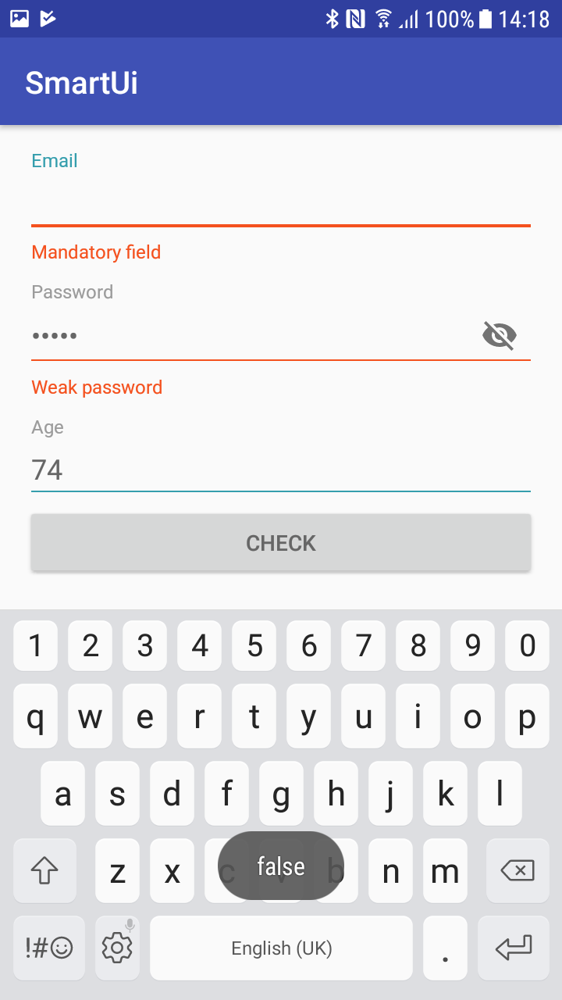

# SmartEditText 
A Smart Material Design EditText for Android that includes validations for most common cases as well as hints and error messages

To get a Git project into your build:

Step 1. Add the JitPack repository to your build file

Add it in your root build.gradle at the end of repositories:

	allprojects {
		repositories {
			...
			maven { url 'https://jitpack.io' }
		}
	}

Step 2. Add the dependency

	dependencies {
	        compile 'com.github.TeleClinic:SmartEditText:0.1.0'
	}

# TO USE

    <com.teleclinic.kabdo.smartmaterialedittext.CustomViews.SmartEditText
        android:id="@+id/emailSmartEditText"
        android:layout_width="match_parent"
        android:layout_height="wrap_content"
        app:setLabel="Email"
        app:setMandatoryErrorMsg="Mandatory field"
        app:setRegexErrorMsg="Wrong email format"
        app:setRegexType="EMAIL_VALIDATION" />

emailSmartEditText.check()

# ATTRIBUTES

setLabel --> Change the label for the EditTextLayout

setTextColor --> Change the text color, for more customizations you can edit the theme style in your styles file!

setMandatory --> Enables validating if the field is filled or not

setMandatoryErrorMsg --> If the field is mandatory and it was not filled, after using .check(), the error message will be displayed below

setRegexType --> Pre defined validatons

    * EMAIL_VALIDATION: Default android regex
    * MEDIUM_PASSWORD_VALIDATION:  8+ letters with 2 out of (a-z, A-Z, digit, sign)
    * COMPLEX_PASSWORD_VALIDATION: 8+ letters with all 4 (a-z, A-Z, digit, sign)
    * PHONE_NUMBER_VALIDATION: Default android regex
    * NAME_VALIDATION: 2 letters+

setRegexString string --> if you want another fancier regex, just enter it here
setRegexErrorMsg string --> Error message text for when the field is not valid according to the regex
setPasswordField --> hides the letters and shows the eye sign to show/hide password 

# EXAMPLES 

    <com.teleclinic.kabdo.smartmaterialedittext.CustomViews.SmartEditText
        android:id="@+id/emailSmartEditText"
        android:layout_width="match_parent"
        android:layout_height="wrap_content"
        app:setLabel="Email"
        app:setMandatoryErrorMsg="Mandatory field"
        app:setRegexErrorMsg="Wrong email format"
        app:setRegexType="EMAIL_VALIDATION" />

    <com.teleclinic.kabdo.smartmaterialedittext.CustomViews.SmartEditText
        android:id="@+id/passwordSmartEditText"
        android:layout_width="match_parent"
        android:layout_height="wrap_content"
        app:setLabel="Password"
        app:setMandatoryErrorMsg="Mandatory field"
        app:setPasswordField="true"
        app:setRegexErrorMsg="Weak password"
        app:setRegexType="MEDIUM_PASSWORD_VALIDATION" />

    <com.teleclinic.kabdo.smartmaterialedittext.CustomViews.SmartEditText
        android:id="@+id/ageSmartEditText"
        android:layout_width="match_parent"
        android:layout_height="wrap_content"
        app:setLabel="Age"
        app:setMandatoryErrorMsg="Mandatory field"
        app:setRegexErrorMsg="Is that really your age :D?"
        app:setRegexString=".*\\d.*" />

